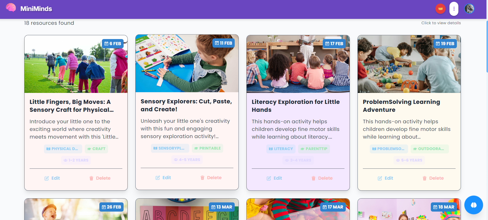
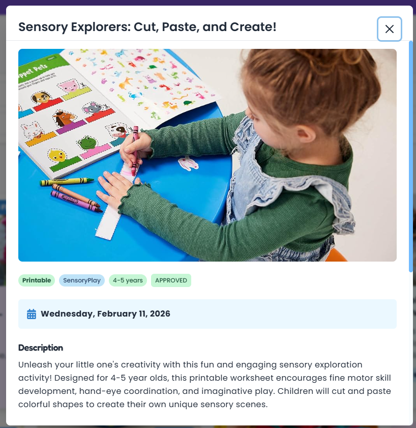
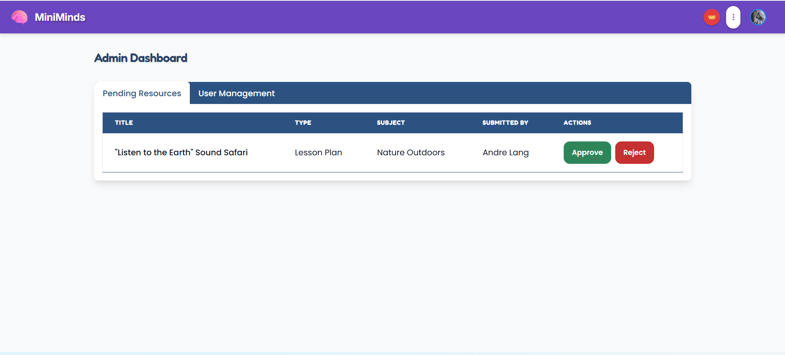

# 🧠 MiniMinds 🧠

> **Engaging preschool learning resources!** ✨

## 🌟 About Mini Minds

Mini Minds is a platform designed to connect educators and parents with  preschool learning resources. 🔍

## ✨ Features

- 🎨 **Colorful, Kid-Friendly Interface**
- 🧩 **Resource Discovery** - Easily find learning materials by subject, type, and age group
- 📤 **Content Sharing** - Educators can contribute their own resources to the community
- 🗓️ **Drag-and-Drop Calendar** - Admins can easily reorder and update event dates directly on the calendar.
- 👑 **Role-Based Access** - Different capabilities for Users, Admins, and Super Admins
- 📱 **Responsive Design**
- 🔐 **Secure Authentication** - Powered by Clerk

## 🛠️ Tech Stack

- **Frontend**: React, TypeScript, Chakra UI
- **Backend**: Node.js, Express
- **Authentication**: Clerk
- **Database**: PostgreSQL
- **Styling**: Chakra UI, Custom Theming

## 🚀 Getting Started

### Prerequisites

- Node.js (v14+)
- npm or yarn
- PostgreSQL

### Installation

1. **Clone the repository**

   ```bash
   git clone https://github.com/yourusername/miniminds.git
   cd miniminds
   ```

2. **Set up the backend**

   ```bash
   cd backend
   npm install
   # Set up your .env file with database and Clerk credentials
   # To add sample data (English, unique dates, no weekends/holidays):
   node scripts/add-sample-resources.js
   # To clear all existing data and Cloudinary images:
   node scripts/cleanup-resources.js
   npm run dev
   ```

3. **Set up the frontend**

   ```bash
   cd frontend
   npm install
   # Set up your .env file with Clerk public key
   npm start
   ```

4. **Open your browser** and navigate to `http://localhost:3000` 🎉

## 🖥️ Usage

### 🧑‍🎓 As a User

- Browse through the collection of learning resources
- Filter resources by subject, type, or age group
- View detailed information about each resource
- Register and sign in to save favorites

### 👨‍🏫 As an Admin

- Create and share new learning resources
- Edit and manage your own resources
- See approval status of your submissions

### 👑 As a Super Admin

- Approve or reject resource submissions
- Manage user accounts and permissions
- Access the admin dashboard for site oversight

## � Getting Started

### System Requirements

- Node.js (v18 or higher)
- PostgreSQL database
- Clerk account for authentication
- Cloudinary account for image uploads
- Google Gemini API key for AI features

### Environment Setup

1. **Clone the repository**

   ```bash
   git clone https://github.com/andrenormanlang/inl5_andre_lang.git
   cd miniminds
   ```

2. **Backend Setup**

   ```bash
   cd backend
   npm install
   ```

   Copy the environment template and fill in your values:

   ```bash
   cp .env.example .env
   ```

   Edit `backend/.env` with your actual credentials:
   - `DATABASE_URL`: Your PostgreSQL connection string
   - `CLOUDINARY_*`: Your Cloudinary credentials
   - `GEMINI_API_KEY`: Your Google Gemini API key
   - `CLERK_*`: Your Clerk authentication keys

3. **Frontend Setup**

   ```bash
   cd frontend
   bun install
   ```

   Copy the environment template and fill in your values:

   ```bash
   cp .env.example .env
   ```

   Edit `frontend/.env` with your actual credentials:
   - `VITE_CLERK_PUBLISHABLE_KEY`: Your Clerk publishable key

4. **Database Setup**

   ```bash
   cd backend
   npx prisma migrate deploy
   npx prisma generate
   ```

5. **Start the application**

   Backend (terminal 1):

   ```bash
   cd backend
   npm run dev
   ```

   Frontend (terminal 2):

   ```bash
   cd frontend
   bun dev
   ```

### 🔐 Required API Keys

| Service           | Purpose        | How to Get                                                     |
| ----------------- | -------------- | -------------------------------------------------------------- |
| **Clerk**         | Authentication | [clerk.com](https://clerk.com) - Create account and get keys   |
| **Cloudinary**    | Image uploads  | [cloudinary.com](https://cloudinary.com) - Free tier available |
| **Google Gemini** | AI features    | [Google AI Studio](https://makersuite.google.com/app/apikey)   |
| **PostgreSQL**    | Database       | [Neon](https://neon.tech) or any PostgreSQL provider           |

## �📸 Screenshots





## 🤝 Contributing

If you have ideas for new features or find any bugs:

1. Fork the repository
2. Create a feature branch (`git checkout -b feature/amazing-feature`)
3. Commit your changes (`git commit -m 'Add some amazing feature'`)
4. Push to the branch (`git push origin feature/amazing-feature`)
5. Open a Pull Request

Made with ❤️ for little learners everywhere 🌈
